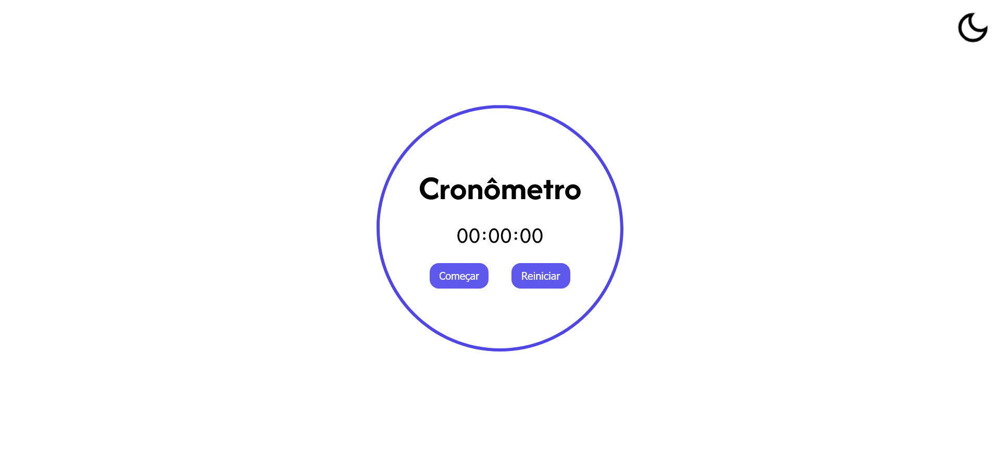

# Stopwatch
[🇺🇸 English](./README.en.md) | [🇧🇷 Português](./README.md)


A simple and elegant stopwatch for the web, designed to measure time intervals with precision. This project features a clean and minimalist interface, with light and dark themes, built with pure HTML, CSS, and JavaScript.

---

### 📋 Table of Contents

- [About the Project](#-about-the-project)
- [Features](#-features)
- [Technologies Used](#-technologies-used)
- [Prerequisites](#-prerequisites)
- [Installation](#-installation)
- [How to Use](#-how-to-use)
- [Want to Contribute?](#-want-to-contribute)
- [License](#-license)
- [Author](#-author)

---

## 📖 About the Project




## ✨ Features

- **Start/Pause:** Control the stopwatch with a single button.
- **Reset:** Reset the stopwatch at any time.
- **Light/Dark Theme:** Switch between themes for more comfortable viewing.

## 🚀 Technologies Used

This project was built using the following technologies:


## ⚙️ Prerequisites

No complications here: just a browser and an internet connection are enough!

## 📦 Installation

```bash
# 1. Clone this repository
$ git clone https://github.com/emellybmuniz/stopwatch.git

# 2. Navigate to the project directory
$ cd stopwatch
```

## 💡 How to Use

1. Open the `index.html` file in your browser.
2. Click **Start** to begin counting.
3. Click **Pause** to stop and **Start** to resume.
4. Click **Reset** to clear the counter.
5. Use the icon in the top right corner to switch between themes.

## 🤔 Want to Contribute?

Any contribution you make will be greatly appreciated! Feel free to open an *issue* or submit a *pull request*. 

1. Fork the project.
2. Create a new *branch* (`git checkout -b feature/your-feature`).
3. Commit your changes (`git commit -m 'Add new feature'`).
4. Push to the *branch* (`git push origin feature/your-feature`).
5. Open a *Pull Request*.

## ✍️ Author

Made by **Emelly Beatriz** with ❤️

📬 Contact:  
📧 emellybmuniz@gmail.com |  
💼 [Linkedin](www.linkedin.com/in/emellybmuniz)
