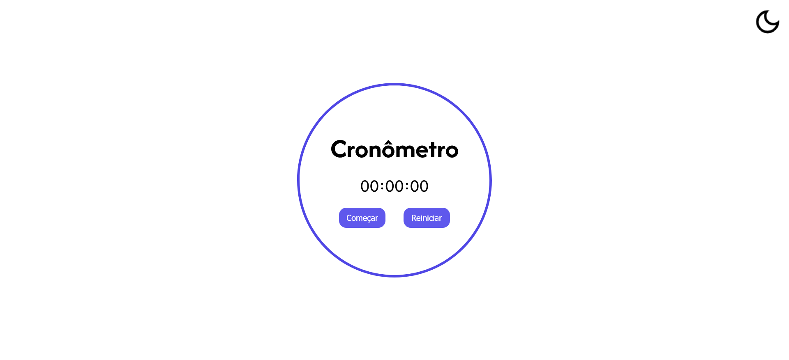

# Stopwatch
[🇺🇸 English](./README.en.md) | [🇧🇷 Português](./README.md)


Um cronômetro simples e elegante para a web, projetado para medir intervalos de tempo com precisão. Este projeto possui uma interface limpa e minimalista, com temas claro e escuro, construído com HTML, CSS e JavaScript puros.

---

### 📋 Índice

- [Sobre o Projeto](#-sobre-o-projeto)
- [Funcionalidades](#-funcionalidades)
- [Tecnologias Utilizadas](#-tecnologias-utilizadas)
- [Pré-requisitos](#-pré-requisitos)
- [Instalação](#-instalação)
- [Como Usar](#-como-usar)
- [Deseja Contribuir?](#-deseja-contribuir)
- [Autor](#-autor)

---

## 📖 Sobre o Projeto




## ✨ Funcionalidades

- **Iniciar/Pausar:** Controle o cronômetro com um único botão.
- **Reiniciar:** Zere o cronômetro a qualquer momento.
- **Tema Claro/Escuro:** Alterne entre os temas para uma visualização mais confortável.

## 🚀 Tecnologias Utilizadas

Este projeto foi construído utilizando as seguintes tecnologias:


## ⚙️ Pré-requisitos

Sem complicações por aqui: só um navegador e conexão com a internet serão o suficiente!

## 📦 Instalação

```bash
# 1. Clone este repositório
$ git clone https://github.com/emellybmuniz/stopwatch.git

# 2. Navegue até o diretório do projeto
$ cd stopwatch
```

## 💡 Como Usar

1. Abra o arquivo `index.html` em seu navegador.
2. Clique em **Começar** para iniciar a contagem.
3. Clique em **Pausar** para interromper e em **Começar** para continuar.
4. Clique em **Reiniciar** para zerar o contador.
5. Use o ícone no canto superior direito para alternar entre os temas.

## 🤔 Deseja Contribuir?

Qualquer contribuição que você fizer será muito apreciada! Sinta-se à vontade para abrir uma *issue* ou enviar um *pull request*. 

1. Faça um *Fork* do projeto.
2. Crie uma nova *branch* (`git checkout -b feature/sua-feature`).
3. Faça o *commit* de suas alterações (`git commit -m 'Adiciona nova feature'`).
4. Faça o *push* para a *branch* (`git push origin feature/sua-feature`).
5. Abra um *Pull Request*.

## ✍️ Autor

Feito por **Emelly Beatriz** com ❤️

📬 Entre em contato:
📧 emellybmuniz@gmail.com |
💼 [Linkedin](www.linkedin.com/in/emellybmuniz)


